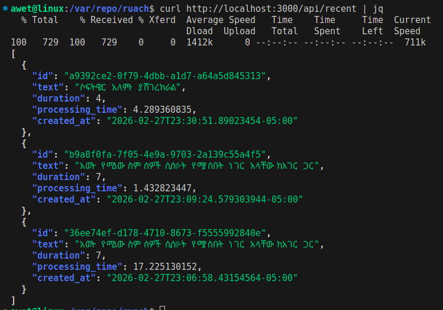

# ruach-api

> Core transcription engine — Part of the Ruach STT platform

Low-latency REST API written in Go. Receives audio in any format, converts with
ffmpeg, forwards to a fine-tuned ruach STT model, and returns Amharic transcript
with timestamps in under 2 seconds.


---

## Performance

```
Audio duration    →  7 seconds
Processing time   →  1.4 seconds
Ratio             →  5x realtime
```

---

## Architecture

```
Browser (any format)
        ↓
   ruach-api (Go)
        ↓
   ffmpeg → wav 16kHz mono
        ↓
   (local fine-tuned model)
        ↓
   Amharic text + timestamps
        ↓
   BoltDB 
```

---

## Stack

```
Go          → core API, net/http
Chi         → router, middleware
ffmpeg      → audio conversion (any format → wav)
BoltDB      → embedded key-value store
faster-whisper → fine-tuned Whisper model serving
```

---

## Endpoints

```
POST /api/transcribe   → upload audio, returns transcript
GET  /api/recent       → last 10 transcriptions
GET  /api/health       → status, model, uptime
```



---

## Protection

```
Global throttle   → max 10 concurrent (GPU protection)
Per IP rate limit → 5 requests per minute
Max file size     → 2MB
Max duration      → 30 seconds
Request timeout   → 60 seconds
```

---

## Run

```bash
go mod tidy
go run main.go
```

```bash
# transcribe
curl -X POST http://localhost:3000/api/transcribe \
  -F "file=@audio.wav"

# recent
curl http://localhost:3000/api/recent

# health
curl http://localhost:3000/api/health
```

---

## Environment

```
API_PORT   → 3000 (default)
RUACH_URL  → http://localhost:8000 (default)
DB_PATH    → ./data/ruach.db (default)
```

---

*Part of the Ruach STT platform — by Awet Tsegazeab*